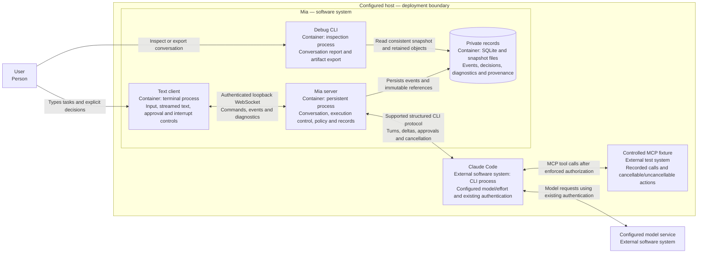
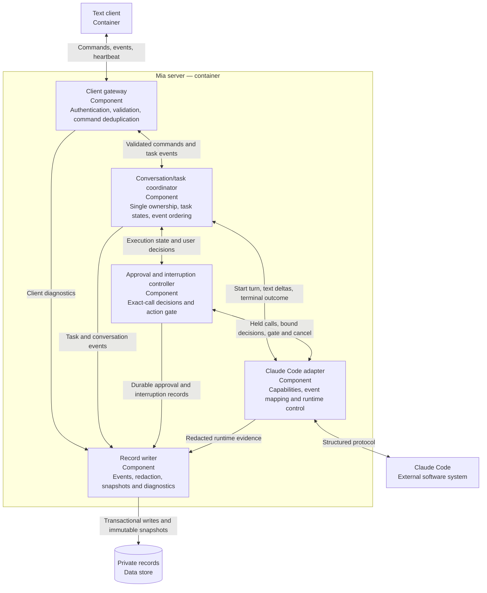
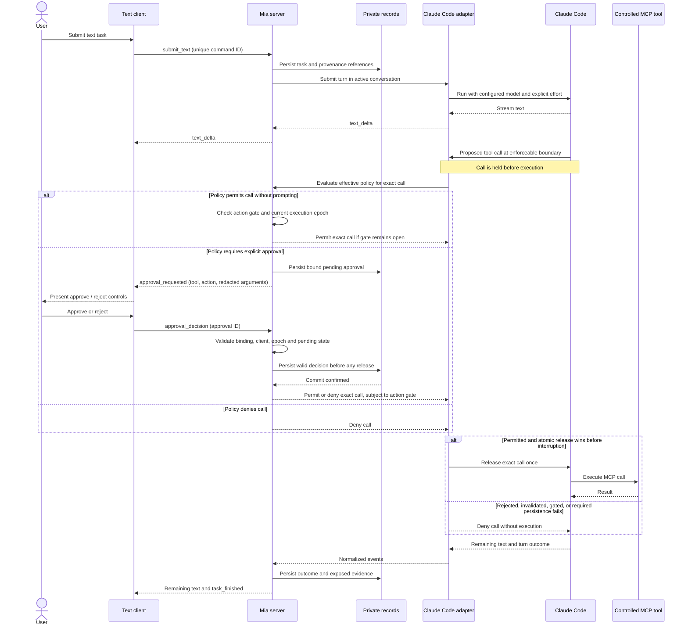

# D1 implementation plan: prove one agent adapter

Implemented (see [capability record](CAPABILITY-RECORD.md) and [acceptance record](ACCEPTANCE-RECORD.md)); awaiting the maintainer acceptance checkpoint. Expands [D1](../PLAN.md#deliverable-1--prove-one-agent-adapter); parent requirements remain authoritative. See [tests](TEST-PLAN.md) and [records](CONVERSATION-RECORDS.md).

## Outcome and scope

A minimal text client sends tasks through a persistent server to the configured agent. Stream results, approve/reject controlled MCP calls, interrupt work, and record executed, blocked, and uncertain outcomes.

One active client, conversation, and task. Follow-ups reuse agent context; additional clients or overlapping tasks receive a busy response. Client and server are separate processes from the first slice.

Exclude voice, product visuals, handoff, notifications, conversation switching/recall, additional runtimes, workers, escalation, jobs, and full reconnect/restart recovery. Include read-only conversation debugging/export and document future storage compatibility. Comprehensive inherited-tool isolation is deferred; unsupported configured-tool enforcement still blocks configuration.

## Work to do before building the slice

1. Pin the configured model identifier. Verify explicit effort-setting support and precedence over inherited settings; defaults or prompt instructions do not count. Reuse tester authentication without copying credentials into configuration or logs.
2. Probe the installed runtime's supported structured interface. Check current official documentation; record runtime/protocol versions. Terminal text parsing is not an approval interface.
3. Prove streaming, exact-call approval/rejection, every-call fixture enforcement, and interruption. Check cached consent, argument changes after approval, and actions during cancellation. Trust fixture counters, not model claims.
4. Record interruption behavior before dispatch and for cancellable/uncancellable in-flight actions. Establish gating for every consequential action exposed by the enabled configuration; fixture-only gating proves only fixture coverage.
5. Record behavior, evidence, limitations, and go/no-go. If enforcement is unavailable, present an alternative integration/runtime for maintainer decision before building the adapter. Never weaken the requirement.

Prepare the probe, fixture, acceptance checklist, and protocol sketch. They are D1 evidence, not another milestone. Defer the desktop app and generalized multi-runtime abstraction.

## Proposed implementation decisions

Agent selection is decided. Other entries are defaults; confirm integration details in the capability record.

| Area | Decision |
| --- | --- |
| Agent selection | Claude Code + Opus; explicitly set `medium` effort on every Mia-owned invocation. Pin model and launch mechanism during the probe. |
| Application | TypeScript client/server with runtime-validated protocol messages; choose and pin the supported Node.js version at implementation time. |
| Text client | Small terminal client with streamed text, an approval panel showing non-secret arguments, explicit approve/reject commands, and an interrupt command. |
| Client transport | Versioned WebSocket protocol on loopback only, authenticated with a local secret stored outside Git. Do not log the secret. Remote access is outside D1. |
| Agent transport | The selected installed CLI's supported structured interface, behind one adapter; exact launch command follows the probe. |
| State | Server-owned state machine; SQLite for conversation/task/approval/event records, content-addressed files for immutable snapshots and larger artifacts. |
| Storage | User-private directory under `$XDG_STATE_HOME/mia` (fallback `~/.local/state/mia`); user configuration outside Git, with generic examples in the repository. |
| Execution | A configured working directory, one agent execution owner, and no automatic retry of an uncertain tool outcome. |

Suggested repository boundaries: `apps/server`, `apps/text-client`, `packages/protocol`, `packages/agent-adapter`, `packages/records`, `fixtures/controlled-mcp`, and `tests/acceptance`. Keep these as ordinary modules initially; separate publishable packages are unnecessary.

## C4 architecture

### Level 2: container view

The diagrams use Mermaid flowcharts with explicit C4 element types. The CLI is an external dependency running on the host, not a Mia-owned implementation. The fixture is a test dependency, not a production tool gateway.



### Level 3: Mia server component view



The controller owns policy/state; the adapter enforces them through proven runtime hooks or tool boundaries. Post-execution notification is not approval enforcement; storage is not consent. The debug CLI shares `packages/records` read-only queries/export, works offline, and cannot invoke agents.

## Sequence diagrams

Required behavior, not verified protocol methods. Probe held-call and action-gate support. Server combines the C4 gateway, coordinator, and controller.

### Text task and policy-driven tool execution



No user response leaves an approval pending; disconnection does not select the approve branch. Invalid or duplicate decisions cannot release a call. Every-call approval is configured for the test fixture only; the no-prompt branch must also be tested with a permitted controlled tool.

### Interruption and a racing approval

```mermaid
sequenceDiagram
    actor User
    participant Client as Text client
    participant Server as Mia server
    participant Records as Private records
    participant Adapter as Claude Code adapter
    participant Claude as Claude Code

    Note over Server,Claude: A task is running; a call may be pending or already dispatched
    User->>Client: Interrupt task
    Client->>Server: interrupt_task
    critical Serialized with exact-call release
        Server->>Server: Close action gate, advance epoch, invalidate pending approvals
        Server->>Records: Record interruption and release ordering
    end
    Server-->>Client: interruption_requested
    Server->>Adapter: Cancel current execution
    Adapter->>Claude: Request supported cancellation
    opt Approval arrives after interruption won the race
        Client->>Server: approval_decision for old epoch
        Server-->>Client: Approval invalidated; no call released
    end
    opt Runtime proposes another consequential action
        Claude->>Adapter: Proposed call at enforceable boundary
        Adapter->>Server: Request dispatch permission
        Server-->>Adapter: Block; action gate closed
        Adapter-->>Claude: Deny dispatch
    end
    alt No call was released before gate closure
        Adapter-->>Server: Cancellation outcome; no tool action in flight
    else Call was already released and cancellation is confirmed
        Claude-->>Adapter: Evidence of action cancellation
        Adapter-->>Server: Action cancelled
    else Call was already released and cannot be stopped
        Claude-->>Adapter: Available action status or completion evidence
        Adapter-->>Server: Completed, still running, or unknown outcome
    end
    Server->>Records: Persist observed outcome, or uncertainty after bounded timeout
    Server-->>Client: interruption_outcome with actual action status
    Client-->>User: Show what stopped and what did not
    Note over Server,Claude: No automatic retry or gate reopening; unknown outcomes are reported to the model on its next turn
```

If release wins the race, the call is in flight and must be reported as such. Cancellation acknowledgement alone is not evidence that the tool's external effect stopped. These orderings become deterministic acceptance tests using the fixture's synchronization barriers.

## Contracts and execution rules

### Client/server contract

Every envelope carries `protocol_version`, `message_id`, `client_id`, type, and payload. Conversation/task/approval identifiers are required where applicable. Server events also carry a monotonic sequence within the conversation and server timestamps. Validate size limits and payload schemas before changing state.

- Client commands: `start_conversation`, `submit_text`, `approval_decision`, `interrupt_task`, and `diagnostic_snapshot`/`heartbeat`.
- Server events: `conversation_started`, `task_started`, `text_delta`, `approval_requested`, `approval_resolved`, `interruption_requested`, `interruption_outcome`, `task_finished`, and `error`.
- Acknowledge accepted commands. Duplicate command IDs return their existing disposition, never a second execution. Missing or unsupported protocol versions produce actionable errors.
- An approval request presents the tool identity, intended action, redacted arguments, and the exact request ID. A decision is valid only from the authenticated active client for that still-pending request.
- Client disconnection is not consent. Mark diagnostics stale and retain pending approval records. D1 need not provide reconnection/resumption UI; terminate test runs explicitly when necessary, preserving unresolved outcomes.

### Runtime adapter contract

Expose `probeCapabilities`, `startConversation`, `submitTurn`, `resolveApproval`, `interrupt`, and `dispose`, plus a normalized event stream. Capability reporting includes runtime/model identity, requested effort, evidence of the explicit effort setting and its effective value where exposed, protocol version, available usage data, approval-policy support, action-gate coverage, and cancellation behavior. Do not couple core event types to one vendor's payloads.

Validate policy before accepting work. Missing runtime/authentication, unavailable model, malformed events, unsupported policy or explicit effort are visible failures. No automatic model/runtime/effort/policy fallback. Record requested model/effort separately from runtime-reported values; mark unreported values unverified. Probe setting mechanism and precedence.

### Approval invariant

Reuse existing permissions unless Mia explicitly requires approval. Permitted calls run without prompts. Every-call approval applies to the controlled fixture, not all MCP tools. Reject unsupported enforcement before enabling a policy.

Bind each pending decision to `(conversation_id, task_id, runtime_call_id, binding_revision, tool_identity, canonical_argument_digest, execution_epoch)` and a server-generated `approval_id`. Use deterministic argument encoding. The digest represents the exact arguments; user-facing and retained payloads are redacted. For a call requiring approval, persist the decision before releasing that specific held call.

An approval is single use. Another call, changed arguments, an expired execution epoch, or a duplicate response cannot reuse it. Rejection never dispatches the call. If the exact intended action cannot be safely explained, the user must be able to reject it; never replace informed approval with a misleading summary. A runtime mechanism that remembers blanket permission cannot satisfy an every-call policy without an additional enforceable boundary.

### Interruption invariant

Task states: `running`, `awaiting_approval`, `interrupting`, then `completed`, `failed`, `interrupted`, or `outcome_unknown`. Keep action outcomes separate from task state: an interrupted task may contain an action that completed.

On interruption, atomically close the gate for new consequential actions and advance the execution epoch before requesting runtime cancellation. Invalidate unresolved approvals from the previous epoch. Serialize approval release and interruption through the same controller so their race has a recorded order: a released action is already in flight; an interruption that wins prevents release.

Record and show which in-flight actions were cancelled, completed, remain running, or have unknown outcomes. Sending a cancel request or killing a CLI process does not prove an external action stopped. Keep the task interrupting while an outcome is being resolved; on a bounded timeout report uncertainty and do not automatically retry. Require a new explicit user turn before opening a new execution epoch. Unknown outcomes are not enforced by the harness beyond that: the next turn carries a Mia-authored note listing them, and the configured per-tool policy applies unchanged (an `allow` tool stays `allow`); whether repeating an action could double an effect is the model's judgement, informed by that note.

### Records and basic diagnostics

Create a conversation directory named by UTC start timestamp plus unique ID. Store conversation, task, client, runtime-call, approval, and event identities with capture/receipt timestamps where relevant. Retain records indefinitely outside Git with restrictive filesystem permissions.

At conversation creation, retain immutable, hashed snapshots of effective Mia agent instructions, exposed runtime instructions, redacted effective configuration, configured/reported model identities, explicit requested effort and available effective-effort evidence, tool contracts, adapter/runtime versions, architecture version and this document's revision, and client/server build identities. Include source commit plus a digest and retained snapshot of relevant local source changes for dirty builds. Record unavailable runtime internals as unavailable; do not claim hidden prompts or reasoning were captured. D1 needs only the agent prompt; introduce a voice prompt when voice exists.

Record streamed text, exposed tool events/results, approvals, interruptions, errors, available usage, and observable timing. Separate local timing from runtime/network measurements only where evidence allows. Never persist credentials or authentication material. Sensitive approval fields stay out of diagnostic snapshots; retain redacted decision evidence and exact-call digests. If a required approval decision cannot be persisted, do not release the call.

The text client reports its build, connection state, recent interaction IDs, errors, and relevant timing at startup, significant state changes, errors, and a lightweight heartbeat. Voice/display fields are explicitly absent or not applicable. Store capture and receipt times and flag stale/missing diagnostics. No screenshots or audio are needed.

### Whole-conversation inspection and artifact export

Implement the [records design](CONVERSATION-RECORDS.md): read-only CLI/static report, artifact catalog/relationships, and consistent evidence export. It defines records, indexes, completeness, and later compatibility gaps.

Connect transcript, task/tool/approval/interruption timelines, diagnostics, outputs, and actual prompt/config/build snapshots. Export records and linked objects through a cutoff, with hashes and missing-evidence inventory. Never replay tools or depend on mutable source paths. This is debugging, not product UI.

## Implementation sequence

| Work item | Concrete output | Exit check |
| --- | --- | --- |
| 1. Capability gate | Probe, controlled MCP fixture, pinned runtime details, capability decision record | Real runtime demonstrates enforceable per-call approval and interruption; gaps are explicit blockers. |
| 2. Contracts and records | Validated messages, state transitions, IDs, indexed private catalog, registered artifacts, immutable provenance snapshots | Invalid/duplicate commands cannot create work; editing a prompt/config/document or original output leaves retained snapshots readable. |
| 3. First streamed turn | Separate server and terminal client, one adapter, configured model and working directory | Real runtime streams a response and accepts a sequential follow-up; errors are visible and attributed. |
| 4. Approval path | Pending-call presentation, durable bound decisions, enforcement and rejection | Fixture counter stays unchanged before approval and after rejection; every new call requires its own decision. |
| 5. Interruption path | Atomic action gate, cancellation mapping, honest outcomes | Controlled races cannot start an action after the gate closes; uncancellable/unknown effects are shown accurately. |
| 6. Evidence and acceptance | Basic diagnostics, whole-conversation report/export, shared adapter checks, setup instructions, demo script and acceptance record | Export integrity and completeness checks plus required adapter checks pass; the live user demo is accepted before scope expands. |

Use scripted adapter substitutes for deterministic protocol/state tests. Reuse the same behavioral assertions against the real adapter wherever its interface permits. Substitutes validate Mia's logic but cannot establish real runtime enforcement. Run the live-lane scenarios through a prompt evaluation harness such as promptfoo, so that agent-prompt versions are compared on fixture-ledger evidence across repeated runs and the live rows of the acceptance record are generated from the same results.

## Verification and user acceptance

The fixture provides an append-only ledger, counter action, and cancellable/uncancellable actions. Barriers control races; no arbitrary sleeps. Effects stay in a disposable directory. Exact setup, messages, and triggers: [test plan](TEST-PLAN.md).

Required automated cases:

- Stream ordering and completion, runtime failure, missing setup, malformed events, and unavailable configured model.
- Every invocation explicitly applies agent selection. Conflicting inherited effort cannot override it; unsupported configuration fails. Provenance distinguishes explicit settings from runtime-reported or unreported values.
- No approval-required fixture call executes before approval; approved call executes once; rejected call never executes; repeated decisions and duplicate commands do not repeat effects.
- A separate controlled tool allowed by the effective policy executes without an approval prompt; configuring every-call approval for the test fixture does not impose it on other tools.
- A second identical call needs fresh approval. Changed arguments under the same runtime ID create a new binding revision and invalidate the old approval. Wrong client/task/call IDs and stale epochs cannot authorize execution.
- Unsupported every-call policy fails before work starts; policy is never inferred from an agent's prose.
- Interruption before release, concurrently with release, and after dispatch; cancellation success, uncancellable completion, and unknown outcomes; no automatic retry or new consequential dispatch while gated.
- Disconnection while approval is pending grants nothing. Record-write failure before authorization leaves the call held or rejected with an explicit error.
- Logs contain required identities and retained snapshots, redact seeded credentials, survive later source/config edits, and distinguish missing diagnostics from current state.

Repeatable live demo:

1. Start a clean ledger, server, and client with the configured agent selection. Inspect capabilities, effort evidence, and provenance.
2. Submit a text task and observe streamed output. Ask a follow-up in the same conversation.
3. Request a fixture action under an every-call policy. Inspect its intended action and arguments; verify no effect before approving. Approve and verify exactly one commit.
4. Request another action and reject it; verify no effect. Request an identical call again and verify a new approval is necessary. Exercise changed-argument handling using the controlled protocol harness if the real runtime cannot deterministically produce it.
5. Interrupt a controlled running task. Demonstrate both cancellable and uncancellable cases and inspect the actual effects and recorded outcomes. Verify that no subsequent consequential action starts during interruption.
6. Inspect client diagnostics and the conversation record. Modify a test prompt/configuration and verify that the original retained snapshots remain intact.
7. Inspect the whole-conversation report and artifact inventory, then export the conversation. Verify the package offline, including a registered generated file and immutable provenance; missing evidence must be explicitly reported. Run the additional record/export checks in the companion storage design.

The acceptance record lists each D1 requirement, evidence location, runtime/model/protocol/build versions, explicit effort and available effective-effort evidence, result, and whether it was demonstrated live, verified with a substitute, or blocked. Include a row for each pass condition in the parent plan. Required unsupported capabilities block acceptance; substitute evidence must never be labelled a live pass. Stop at the D1 user acceptance checkpoint.

## Remaining decisions

Resolve the exact model identifier and working directory during the probe; hard-code no personal account/path. Investigate capability gaps before asking the maintainer to choose alternatives. Stack/client defaults need no separate planning approval. No immediate product clarification or later-deliverable decision is needed; implementation requires a successful probe.
